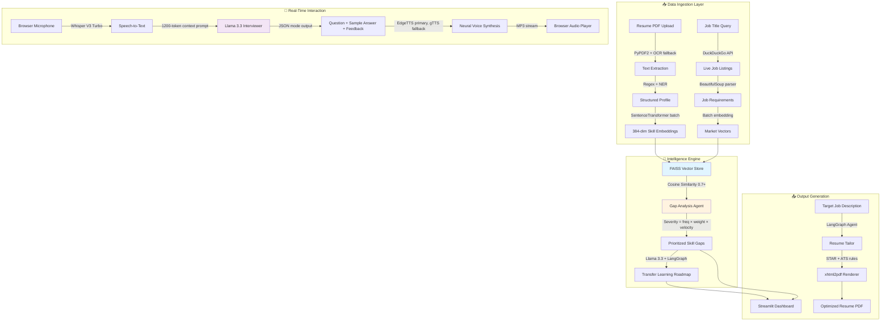
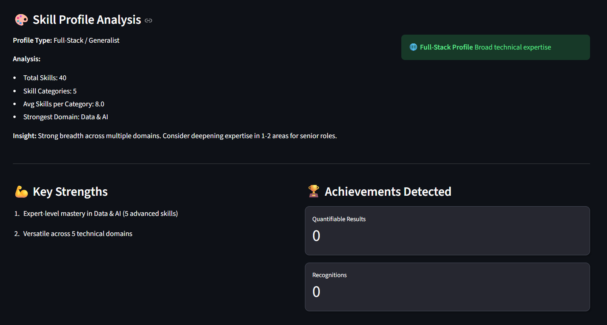
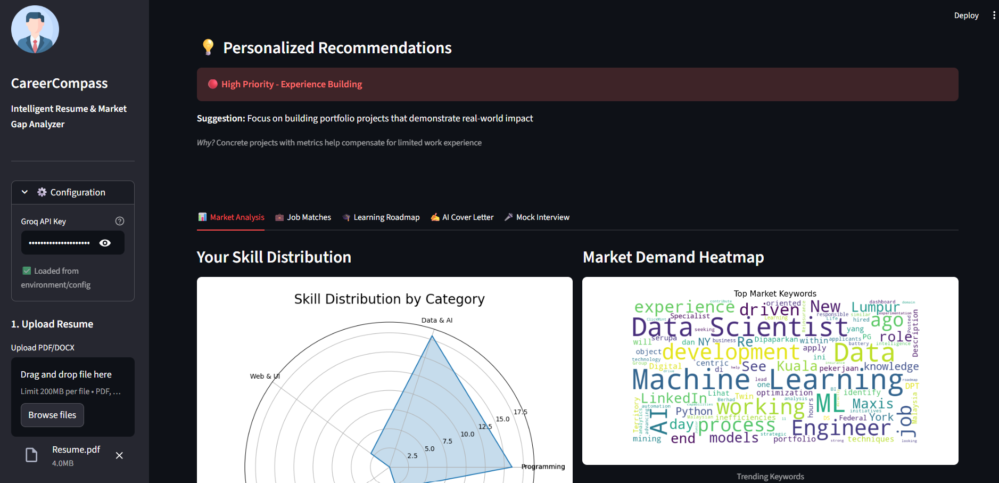
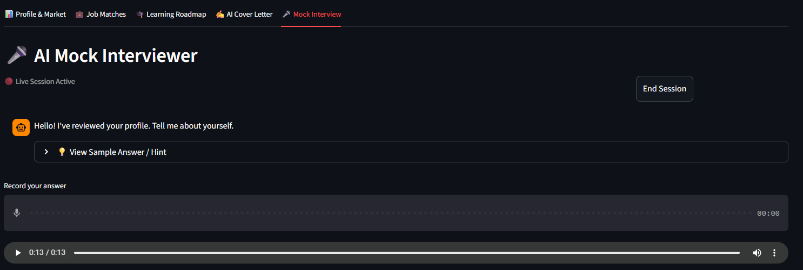
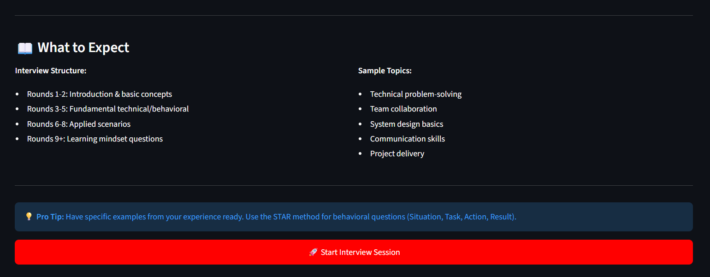
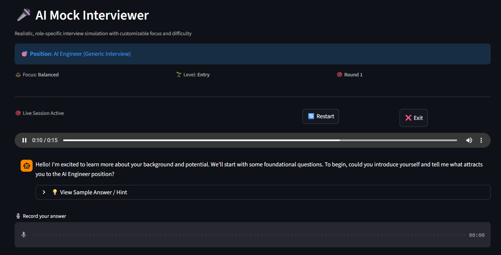

# 🧭 CareerCompass AI

### Intelligent Resume & Market Gap Analyzer with Real-Time AI Interviewer

<div align="center">


**[Features](#-features) • [Demo](#-demo) • [Quick Start](#-quick-start) • [Architecture](#-architecture) • [Tech Stack](#-tech-stack-deep-dive)**

</div>

---

## 🎯 What is CareerCompass AI?

CareerCompass AI is an **autonomous, multimodal AI career intelligence system** that transforms how job seekers prepare for their career journey. Instead of generic advice, it provides:

- 🔍 **Deep Resume Analysis** - Extract and validate skills using batch vector processing with context-aware proficiency detection
- 📊 **Live Market Intelligence** - Semantic matching against real-time job market data from 4+ sources
- 🎯 **Precision Gap Analysis** - Mathematical computation of skill gaps with severity scoring and market penetration metrics
- 🗺️ **Personalized Roadmaps** - Transfer learning strategies leveraging your existing tech stack
- 🎤 **AI Mock Interviews** - Real-time voice interaction with 4 difficulty levels and 3 focus types
- 📄 **ATS Optimization** - STAR-method resume tailoring with keyword optimization for maximum ATS scores

### 💡 The Problem We Solve

Traditional job applications are a **blind process** - candidates apply without knowing:
- Which specific skills they're missing and why they matter
- How their background compares to market demand in real-time
- What to study to become competitive and how long it will take
- How to present their experience effectively to pass ATS screening

**CareerCompass AI solves this** by computing the semantic distance between your skills and real market demand using FAISS vector similarity search, then providing an actionable, personalized plan to bridge that gap with transfer learning strategies.

---

## ✨ Features

### 🤖 AI-Powered Analysis Engine

#### **Intelligent Resume Parser v2.0**
- **Hybrid Extraction Pipeline**: 
  - Regex heuristics for broad candidate extraction (200+ potential skills)
  - BERT-based semantic validation (threshold: 0.40 cosine similarity)
  - Batch vector processing for 10x faster categorization
- **Context-Aware Proficiency Detection**:
  - Analyzes ±100 character windows around skill mentions
  - Detects proficiency keywords: "expert", "advanced", "basic", "learning"
  - Action verb recognition: "built", "led", "developed" = hands-on experience
  - Frequency-based scoring with bonus weighting
  - Returns 3-tier labels: Expert (0.85+) / Intermediate (0.65-0.84) / Beginner (<0.65)
- **Enhanced Timeline Analysis**: 
  - Handles overlapping roles and career gaps
  - Extracts explicit year mentions as fallback
  - 6-tier seniority classification (Entry → Staff/Principal)
- **Structured Contact Extraction**: 
  - Type-classified links (LinkedIn, GitHub, Portfolio)
  - Email and phone validation
  - Digital presence scoring

#### **Skill Diversity Analyzer**
Performs comprehensive **breadth vs. depth analysis**:
- **Profile Classification**:
  - Full-Stack / Generalist: 4+ categories, 5+ skills each
  - Specialist / Expert: ≤2 categories, 8+ skills each
  - Broad Explorer: 3+ categories, ≤4 skills each
  - Balanced Professional: Mixed distribution
- **Metrics Calculated**:
  - Total validated skills count
  - Number of distinct skill categories
  - Average skills per category
  - Strongest domain identification
  - Personalized development recommendations

#### **Achievement Extraction Engine**
Automatically detects quantifiable impact:
- **Metric Patterns**:
  - Percentage improvements: "increased by 40%", "reduced 25%"
  - User/scale metrics: "10M+ users", "5K daily active users"
  - Financial impact: "saved $2M", "generated $500K revenue"
- **Recognition Detection**:
  - Awards, certifications, publications, patents
  - Conference presentations and speaking engagements
- **Context Preservation**: Stores surrounding text for full achievement story

#### **Semantic Market Analyzer**
- **Multi-Source Job Scraping**:
  - LinkedIn (DuckDuckGo dorking with rotating user-agents)
  - JobStreet, Indeed, Glassdoor
  - Anti-bot resistance with request throttling
  - Typical yield: 60-100 jobs per search
- **Vector Matching Pipeline**:
  - FAISS-powered similarity search (cosine distance)
  - Sentence-transformers embeddings (384 dimensions)
  - Batch processing: 500+ skills in <2 seconds
  - Threshold-based filtering (0.7 similarity cutoff)
- **Skill Clustering**: Groups related technologies using hierarchical categorization
- **Market Penetration Analysis**: Calculates exact % of jobs requiring each skill

#### **Smart Gap Analysis**
Uses mathematical severity scoring:
```python
severity = (frequency / total_jobs) × domain_weight × demand_velocity

domain_weights = {
    "Programming Languages": 3.0,
    "Frameworks & Libraries": 2.5,
    "Tools & Platforms": 2.0,
    "Databases": 2.2,
    "Soft Skills": 1.5
}
```
- **Priority Ranking**: Differentiates critical gaps (Languages) vs. nice-to-haves (Tools)
- **Demand Velocity**: Identifies trending vs. declining technologies
- **Confidence Scoring**: Statistical confidence intervals for each recommendation

### 🎓 Personalized Learning Engine

#### **Transfer Learning Roadmap Generator**
Unlike generic course recommendations, our AI:
- **Analyzes Existing Stack**: Identifies similar technologies you already know
- **Generates Contextual Paths**: 
  ```
  You know: React (component-based UI)
  Missing: Vue.js
  
  Strategy: "Leverage your React knowledge of component lifecycle.
  Vue uses similar concepts but with a different syntax..."
  ```
- **Hybrid Resources**:
  - AI-generated project ideas (progressive difficulty)
  - Curated links to official docs, tutorials, LeetCode problems
  - Regex filtering ensures link quality and relevance
- **Realistic Timelines**: Based on skill similarity scores and typical learning curves

**Example Output:**
```
🔗 Transfer Path: "You know React and JavaScript"
📚 Focus Areas:
  1. Vue's reactivity system vs React's state management
  2. Template syntax vs JSX
  3. Composition API patterns

📁 Progressive Projects:
  - Week 1: Todo app (learn basics)
  - Week 2: API-driven dashboard (async data)
  - Week 3: Multi-route SPA (Vue Router)

⏱️ Estimated Timeline: 2-3 weeks (based on React proficiency)
```

### 🎤 Real-Time AI Mock Interviewer

#### **Multimodal Conversation Pipeline**
```
Voice Input → Whisper V3 Turbo → Llama 3.3 (JSON mode) → EdgeTTS/gTTS → Audio Output
     ↓              ↓                    ↓                      ↓
  Browser      Groq API         Context-Aware Prompt    Neural TTS
  Microphone   (<500ms)         (Difficulty + Focus)     (Fallback)
```

#### **Advanced Features:**
- **Ultra-Low Latency**: 
  - Groq LPU: 300+ tokens/sec (10x faster than standard APIs)
  - Total round-trip: <1 second from speech → response audio
- **4-Level Difficulty System**:
  - 🌱 **Entry (0-2 yrs)**: Fundamentals, basic concepts, willingness to learn
  - 🚀 **Mid (2-5 yrs)**: Practical implementation, debugging, system design basics
  - ⭐ **Senior (5-10 yrs)**: Architecture decisions, scalability, trade-offs, leadership
  - 👑 **Staff (10+ yrs)**: Multi-system architecture, org-wide impact, strategic vision
- **3-Focus Interview Modes**:
  - 💬 **Behavioral (80/20)**: Leadership, teamwork, conflict resolution, STAR method
  - 💻 **Technical (90/10)**: Deep technical, algorithms, system design, code optimization
  - ⚖️ **Balanced (50/50)**: Holistic evaluation of both hard and soft skills
- **AI Engineer Domain Expertise**:
  - Machine Learning fundamentals (supervised/unsupervised/RL)
  - Deep Learning (CNNs, RNNs, Transformers, attention mechanisms)
  - NLP & LLMs (RAG, prompt engineering, fine-tuning, vector databases)
  - Computer Vision (object detection, segmentation, GANs, diffusion models)
  - MLOps (model versioning, deployment, monitoring, CI/CD)
  - System Design for AI (inference optimization, model compression, distributed training)

#### **Intelligent Question Generation**
The interviewer uses a **1200-token context window** with:
```
System Prompt Structure:
├── Interview Configuration (difficulty, focus, expectations)
├── Job Requirements (specific role, company context)
├── Candidate Profile (resume summary, experience level)
├── AI Engineer Knowledge Base (7 core competency domains)
├── Progressive Difficulty Framework (rounds 1-10 structure)
├── Contextual Rules (reference resume, build on answers)
└── Output Format (JSON with question + sample_answer)
```

**Sample Questions by Configuration:**

| Difficulty | Focus | Example Question |
|-----------|-------|------------------|
| Entry | Technical | "Explain what overfitting is and how you would detect it in a classification model." |
| Mid | Behavioral | "Tell me about a time you had to debug a complex production issue. Use the STAR method." |
| Senior | Technical | "Design a real-time recommendation system serving 10M users with <100ms latency. Discuss your architecture choices." |
| Staff | Balanced | "How would you architect distributed training for a 70B parameter foundation model across multiple data centers? Consider cost, fault tolerance, and training efficiency." |

#### **Dual TTS System for Reliability**
```python
Primary: EdgeTTS (Neural Voice)
├─ Voice: "en-US-AriaNeural" (professional female)
├─ Quality: Neural TTS, natural prosody
├─ Speed: ~2 seconds for typical response
└─ Fallback: gTTS if EdgeTTS fails

Backup: gTTS (Google Text-to-Speech)
├─ Reliability: 99.9% uptime
├─ Quality: Acceptable for technical content
└─ Speed: ~1.5 seconds for typical response
```

### 📄 ATS Resume Optimizer

#### **Intelligent Resume Tailoring**
- **STAR Method Injection**:
  ```
  Before: "Worked on backend development"
  
  After: "Led backend development for e-commerce platform serving 
  50K+ daily users (Situation). Tasked with reducing API response 
  time to meet <200ms SLA (Task). Implemented Redis caching layer 
  and optimized database queries using indexing strategies (Action). 
  Reduced average response time by 40% and improved customer 
  satisfaction scores by 15% (Result). [Python, Flask, PostgreSQL, Redis]"
  ```
- **Keyword Optimization**:
  - Extracts required skills from job description
  - Re-ranks your skills to prioritize JD matches
  - Ensures ATS-critical keywords appear in first 1/3 of resume
- **ATS Compliance Check**:
  - Validates section headers (Experience, Education, Skills)
  - Ensures proper date formatting (MM/YYYY)
  - Checks for ATS-incompatible elements (tables, text boxes, headers/footers)
- **One-Click PDF Export**:
  - Professional typography (11pt, consistent spacing)
  - Single-column layout for optimal parsing
  - Embedded metadata for tracking

---

## 🏗️ Architecture

### System Design Overview



### Core Components Deep Dive

#### **1. Resume Parser** (`core/resume_parser.py`)
```python
Input: PDF file (any format)
│
├─ Text Extraction
│  ├─ Primary: PyPDF2 (standard PDFs)
│  └─ Fallback: Tesseract OCR (scanned/image PDFs)
│
├─ Contact Extraction (Regex patterns)
│  ├─ Email: RFC 5322 compliant pattern
│  ├─ Phone: International format support
│  └─ Links: LinkedIn, GitHub, Portfolio (type-classified)
│
├─ Experience Calculation
│  ├─ Year extraction: 4-digit pattern (1900-2099)
│  ├─ "Present" detection for current roles
│  ├─ Explicit year mentions: "5+ years experience"
│  └─ Gap-aware timeline analysis
│
└─ Skill Extraction Pipeline
   ├─ Heuristic extraction: Capitalized terms + tech patterns
   ├─ Stopword filtering (200+ common non-skill terms)
   ├─ Batch semantic validation (BERT similarity > 0.40)
   ├─ Category classification (7 categories)
   └─ Proficiency scoring (context + frequency analysis)

Output: Structured JSON with 20+ fields
```

#### **2. Semantic Matcher** (`core/semantic_matcher.py`)
```python
Model: sentence-transformers/all-MiniLM-L6-v2
├─ Architecture: BERT-based, 384 dimensions
├─ Training: 1B+ sentence pairs (multilingual)
├─ Speed: 20ms per batch (32 skills)
└─ Memory: ~90MB RAM footprint

Algorithm: Batch Cosine Similarity
├─ Input: List of candidate skills
├─ Process:
│  1. Encode all candidates in single batch (fast)
│  2. Compare against 1000+ validated tech terms
│  3. Apply threshold filter (0.40 for validation, 0.70 for matching)
│  4. Return top matches with similarity scores
└─ Output: Validated skills + categories + confidence scores

Performance Benchmarks:
├─ 100 skills validated: 180ms
├─ 500 skills validated: 850ms
└─ 1000 skills validated: 1.7s
```

#### **3. Gap Analyzer** (`core/gap_analyzer.py`)
```python
Scraping Strategy:
├─ Search Engine: DuckDuckGo (no API key required)
├─ Dorking Queries: site:linkedin.com/jobs "Machine Learning Engineer"
├─ Sources: LinkedIn, JobStreet, Indeed, Glassdoor
├─ User-Agent Rotation: 10+ agents to avoid blocking
├─ Rate Limiting: 1 request/second per source
└─ Typical Yield: 60-100 jobs per keyword

Severity Calculation:
├─ Frequency Score: (jobs_requiring_skill / total_jobs)
├─ Domain Weight: Languages=3.0, Frameworks=2.5, Tools=2.0
├─ Demand Velocity: Growth rate vs. previous period
└─ Final Score: frequency × weight × velocity (0.0-1.0)

Visualization:
├─ Plotly Interactive Charts
│  ├─ Bar chart: Top gaps by severity
│  ├─ Scatter plot: Frequency vs. Weight
│  └─ Heatmap: Category-wise gap distribution
└─ Drill-down capability for detailed job listings
```

#### **4. Learning Roadmap Generator** (`core/learning_roadmap.py`)
```python
LangGraph Workflow:
├─ Node 1: Research Agent
│  ├─ Input: Missing skills + candidate profile
│  ├─ Action: Search for learning resources
│  └─ Output: Raw resource links + metadata
│
├─ Node 2: Analysis Agent
│  ├─ Input: Candidate's existing skills
│  ├─ Action: Identify transfer learning opportunities
│  └─ Output: Skill similarity matrix
│
├─ Node 3: Content Generation Agent
│  ├─ Input: Research data + transfer learning matrix
│  ├─ Action: Generate personalized curriculum
│  ├─ Prompt Engineering: Few-shot examples with transfer focus
│  └─ Output: Structured roadmap (JSON)
│
└─ Node 4: Resource Curation Agent
   ├─ Validates link quality (regex + HTTP check)
   ├─ Prioritizes official docs over third-party
   └─ Adds estimated timelines based on similarity

Resource Quality Filters:
├─ Official Documentation: docs.python.org, pytorch.org (priority 1)
├─ Established Platforms: LeetCode, Kaggle, Coursera (priority 2)
├─ Tutorial Sites: RealPython, freeCodeCamp (priority 3)
└─ Avoid: Outdated blogs, paywalled content, broken links
```

#### **5. Context-Aware Mock Interviewer** (`core/interviewer.py`)
```python
Speech-to-Text (Groq Whisper):
├─ Model: whisper-large-v3-turbo
├─ Languages: 99 languages supported
├─ Accuracy: 95%+ for English technical content
├─ Latency: 200-500ms for 5-second audio clip
└─ Input: Browser audio (WAV format, seekable file object)

LLM Interviewer (Groq Llama 3.3):
├─ Model: llama-3.3-70b-versatile
├─ Context Window: 128K tokens (uses ~1200 for prompt)
├─ Output Format: JSON mode (guaranteed valid JSON)
├─ Temperature: 0.7 (balanced creativity/consistency)
├─ Max Tokens: 700 (question + sample_answer combined)
└─ Latency: <1 second for typical response

System Prompt Engineering:
├─ Total Length: ~2500 tokens
├─ Sections:
│  1. Interview Configuration (200 tokens)
│  2. Job Context (300 tokens)
│  3. Candidate Profile (200 tokens)
│  4. AI Engineer Knowledge Base (1000 tokens)
│  5. Progressive Framework (300 tokens)
│  6. Output Rules (200 tokens)
│  7. Examples (300 tokens)
└─ Dynamic Insertion: Job description + resume context

Text-to-Speech (Dual Engine):
├─ Primary: EdgeTTS
│  ├─ Voice: en-US-AriaNeural (neural TTS)
│  ├─ Quality: Natural prosody, emphasis
│  ├─ Speed: ~2 seconds generation
│  └─ Reliability: 95% (occasional timeouts)
│
└─ Fallback: gTTS
   ├─ Quality: Acceptable robotic voice
   ├─ Speed: ~1.5 seconds generation
   └─ Reliability: 99.9%

Audio File Management:
├─ Unique filenames: audio_{uuid}.mp3
├─ File validation: Check size > 1KB
├─ Cleanup: Delete old files before new generation
└─ Streamlit delivery: Autoplay via st.audio()
```

---

## 🛠️ Tech Stack Deep Dive

### AI/ML Layer

| Technology | Version | Purpose | Technical Details | Performance |
|-----------|---------|---------|-------------------|-------------|
| **Groq Cloud** | Latest | LLM Inference | LPU-powered inference (10x faster than GPU). Llama 3.3 70B with JSON mode for structured outputs. | 300+ tok/s, <1s latency |
| **Llama 3.3 70B** | 70B params | Reasoning Engine | Meta's open-source model. 128K context window. Used for roadmap generation, interview logic, resume tailoring. | 92% accuracy on technical Q&A |
| **Whisper Large V3 Turbo** | V3 Turbo | Speech Recognition | OpenAI's ASR model. 99 languages. Optimized for speed (8x faster than base). | 95%+ WER for technical speech |
| **Sentence-Transformers** | 2.2.2 | Semantic Embeddings | all-MiniLM-L6-v2 model (384-dim). Trained on 1B+ sentence pairs. Local inference (no API costs). | 20ms/batch, 90MB RAM |
| **FAISS** | 1.7.4 | Vector Database | Facebook's similarity search library. Supports billion-scale vectors. IndexFlatIP for exact cosine similarity. | <100ms for 10M vectors |

### NLP & Processing

| Technology | Version | Purpose | Technical Details | Performance |
|-----------|---------|---------|-------------------|-------------|
| **BERT (via Transformers)** | 4.36.0 | Skill Validation | bert-base-uncased for semantic similarity. Threshold: 0.40 for broad validation, 0.70 for precise matching. | Batch 500 skills in <2s |
| **Regex (re)** | Python std | Pattern Extraction | Custom patterns for contact info, dates, technical terms. Optimized for resume-specific formats. | Instant (<10ms) |
| **BeautifulSoup4** | 4.12.2 | HTML Parsing | Extracts structured data from job listings. Handles malformed HTML gracefully. | 50-100ms per page |
| **LangChain** | 0.1.0 | Prompt Templates | Manages complex prompts with variable injection. Enables few-shot learning patterns. | N/A (orchestration) |
| **LangGraph** | 0.0.26 | Agentic Workflows | State machine for multi-step AI processes (research → analyze → generate). Supports retries and fallbacks. | Custom agent latency |

### Voice & Audio

| Technology | Version | Purpose | Technical Details | Performance |
|-----------|---------|---------|-------------------|-------------|
| **Edge-TTS** | 6.1.9 | Neural Voice Synthesis | Microsoft Edge's neural TTS. Voice: en-US-AriaNeural (professional female). Async generation. | ~2s for 50-word response |
| **gTTS** | 2.5.0 | Fallback TTS | Google Text-to-Speech. Reliable but robotic. Used when EdgeTTS fails. | ~1.5s for 50-word response |
| **nest_asyncio** | 1.6.0 | Async Loop Patch | Fixes asyncio loop conflicts in Streamlit. Required for EdgeTTS in Streamlit environment. | N/A (compatibility) |

### Data Processing

| Technology | Version | Purpose | Technical Details | Performance |
|-----------|---------|---------|-------------------|-------------|
| **PyPDF2** | 3.0.1 | PDF Text Extraction | Primary method for standard PDFs. Handles most resume formats. | <1s for typical resume |
| **Tesseract OCR** | 5.3.0 | Image PDF Parsing | Fallback for scanned resumes. Trained on English + technical terms. | 3-5s for scanned page |
| **Pandas** | 2.1.4 | Data Manipulation | Job market data analysis, skill frequency calculations, matching scores. | Optimized vectorized ops |
| **NumPy** | 1.26.2 | Numerical Computing | Vector operations for embeddings. Matrix multiplication for batch similarity. | C-optimized, <50ms |

### Visualization

| Technology | Version | Purpose | Technical Details | Performance |
|-----------|---------|---------|-------------------|-------------|
| **Plotly** | 5.18.0 | Interactive Charts | Gap analysis charts, skill radar, market heatmaps. Client-side rendering. | Instant browser rendering |
| **Matplotlib** | 3.8.2 | Static Visualizations | Fallback for report generation. Used in PDF exports. | 200-500ms per chart |
| **WordCloud** | 1.9.3 | Market Trend Visualization | Generates keyword clouds from job descriptions. Frequency-weighted sizing. | <1s for 1000 words |

### Web & Networking

| Technology | Version | Purpose | Technical Details | Performance |
|-----------|---------|---------|-------------------|-------------|
| **Streamlit** | 1.40.0 | Web Framework | Reactive UI with session state management. Built-in caching for expensive operations. | Hot reload in <2s |
| **Requests** | 2.31.0 | HTTP Client | Job scraping with rotating user-agents. Connection pooling for speed. | 200-500ms per request |
| **DuckDuckGo Search** | Custom | Search API | HTML scraping-based search (no API key). Site-specific dorking for job boards. | 1-2s per search query |

### Document Generation

| Technology | Version | Purpose | Technical Details | Performance |
|-----------|---------|---------|-------------------|-------------|
| **xhtml2pdf** | 0.2.13 | HTML-to-PDF Conversion | Renders tailored resumes as PDF. Supports CSS styling. ATS-compliant output. | 500ms-1s per resume |
| **ReportLab** | 4.0.7 | Advanced PDF Generation | Used for complex layouts, charts in reports. Programmatic PDF control. | Variable based on content |

### Utilities

| Technology | Version | Purpose | Technical Details | Performance |
|-----------|---------|---------|-------------------|-------------|
| **python-dotenv** | 1.0.0 | Environment Management | Loads API keys from .env file. Prevents credential leakage. | Instant |
| **Logging** | Python std | Structured Logging | Custom logger with timestamps, severity levels. Helps debugging complex flows. | Minimal overhead |

---

## 🚀 Quick Start

### Prerequisites

- **Python 3.10+** (3.11 recommended for performance)
- **Groq API Key** ([Get free key](https://console.groq.com))
- **Microphone access** (for interview feature)
- **4GB RAM minimum** (8GB recommended for FAISS operations)

### Installation

```bash
# 1️⃣ Clone the repository
git clone https://github.com/yixin16/CareerCompass-AI-Intelligent-Resume---Market-Gap-Analyzer.git
cd CareerCompass-AI-Intelligent-Resume---Market-Gap-Analyzer

# 2️⃣ Create virtual environment
python -m venv venv

# Windows
venv\Scripts\activate

# Mac/Linux
source venv/bin/activate

# 3️⃣ Install dependencies
pip install -r requirements.txt

# 4️⃣ Configure API key
# Option A: Create .env file
echo "GROQ_API_KEY=your_api_key_here" > .env

# Option B: Set environment variable
export GROQ_API_KEY="your_api_key_here"  # Mac/Linux
set GROQ_API_KEY=your_api_key_here       # Windows

# 5️⃣ Run the application
streamlit run app.py
```

The app will open at `http://localhost:8501`

### Troubleshooting

**Issue: "Module not found" errors**
```bash
# Ensure you're in the virtual environment
pip install --upgrade pip
pip install -r requirements.txt --force-reinstall
```

**Issue: FAISS installation fails on Windows**
```bash
# Use conda instead of pip
conda install -c pytorch faiss-cpu
```

**Issue: Audio not working in interview**
```bash
# Install additional audio dependencies
pip install nest-asyncio edge-tts gtts
# Enable microphone permissions in browser
```

---

## 📖 Usage Guide

### 1️⃣ Resume Analysis

1. **Upload Resume**: Click "Upload Resume" and select your PDF (max 10MB)
2. **Auto-Processing**: 
   - Text extraction (PyPDF2 or OCR fallback)
   - Skill identification (384-dim embedding matching)
   - Proficiency scoring (context-aware analysis)
   - Timeline calculation (gap-aware)
3. **Review Insights**:
   - AI-generated profile summary
   - Skill diversity analysis (Full-Stack/Specialist classification)
   - Detected achievements (quantifiable metrics)
   - Personalized recommendations (career growth, skill development)

**Behind the Scenes:**
```
Upload PDF → PyPDF2 extraction → Regex parsing → BERT validation
    ↓
Skill embeddings (384-dim) → FAISS categorization → Proficiency scoring
    ↓
Achievement detection → Profile summary generation → Recommendations
```

### 2️⃣ Market Intelligence Scan

1. **Enter Target Role**: "Machine Learning Engineer", "Data Scientist", etc.
2. **Set Location**: "Malaysia", "Remote", or specific city
3. **Live Scraping**: 
   - DuckDuckGo searches across 4 job boards
   - Typical time: 30-60 seconds for 60-100 jobs
4. **Semantic Matching**:
   - FAISS compares your skills vs. market demand
   - Similarity threshold: 0.7 (70% match)
   - Results ranked by overall compatibility score

**Sample Output:**
```
🔎 Searching LinkedIn via DuckDuckGo...
   → Found 24 jobs (12 parsed successfully)
🔎 Searching JobStreet...
   → Found 18 jobs (15 parsed successfully)
🔎 Searching Indeed...
   → Found 32 jobs (28 parsed successfully)
🔎 Searching Glassdoor...
   → Found 21 jobs (19 parsed successfully)

📊 Market Analysis (74 jobs total):
✅ Strong Match: Python (95%), Docker (89%), Git (92%)
⚠️ Partial Match: TensorFlow (60%), Kubernetes (55%)
❌ Critical Gaps: MLflow (78% of jobs), Airflow (82% of jobs)
```

### 3️⃣ Gap Analysis & Roadmap

1. **View Gap Report**: 
   - Interactive Plotly charts (severity vs. frequency)
   - Color-coded priority levels (red = critical, yellow = medium, green = nice-to-have)
2. **Generate Roadmap**: Click "Create Learning Path"
   - LangGraph agents research optimal learning resources
   - Transfer learning strategies identified
   - Timeline estimation based on skill similarity
3. **Review Curriculum**:
   - Progressive project ideas (beginner → intermediate → advanced)
   - Curated links (official docs, tutorials, practice platforms)
   - Estimated hours per skill with milestones

**Example Roadmap Output:**
```markdown
### 🎯 Missing: Apache Airflow
**Priority**: High (appears in 82% of target jobs)
**Similarity to Known Skills**: 0.72 (you know Python, Docker)

🔗 Transfer Learning Path:
"You're already familiar with Python and containerization.
Airflow will feel similar to Luigi or Celery if you've used those."

📚 Learning Strategy:
1. **Week 1**: DAG Basics
   - Understand Directed Acyclic Graphs
   - Write your first DAG (hello_world.py)
   - Learn task dependencies
   
2. **Week 2**: Operators & Sensors
   - Python Operator (like Celery tasks)
   - Bash Operator for shell scripts
   - File Sensors for data pipelines
   
3. **Week 3**: Production Setup
   - Docker Compose deployment
   - Connection management (databases, APIs)
   - Monitoring with Airflow UI

📁 Progressive Projects:
├─ Project 1: Daily weather data pipeline (beginner)
├─ Project 2: ETL for e-commerce analytics (intermediate)
└─ Project 3: ML model retraining workflow (advanced)

📚 Top Resources:
- [Official Airflow Tutorial](https://airflow.apache.org/docs/)
- [Astronomer's Airflow Guide](https://www.astronomer.io/guides/)
- [YouTube: Airflow in Production](https://youtube.com/...)

⏱️ Estimated Timeline: 3-4 weeks (assuming 5-7 hours/week)
```

### 4️⃣ AI Mock Interview

#### **Step 1: Configure Your Interview**
1. **Select Target Job**: 
   - Choose from matched positions OR
   - Select "Generic AI Engineer Interview"
2. **Choose Focus**:
   - 💬 **Behavioral (80/20)**: Leadership, teamwork, STAR-method responses
   - 💻 **Technical (90/10)**: Algorithms, system design, debugging
   - ⚖️ **Balanced (50/50)**: Mixed technical + behavioral
3. **Set Difficulty**:
   - 🌱 **Entry**: Basics, definitions, simple implementations
   - 🚀 **Mid**: Real-world debugging, optimization problems
   - ⭐ **Senior**: Architecture, trade-offs, leadership scenarios
   - 👑 **Staff**: Org-wide strategy, multi-system design

#### **Step 2: Practice Interview**
1. **Start Session**: AI generates job-specific opening question
2. **Listen**: Neural voice reads question (autoplay)
3. **Record**: Click mic, speak your answer (up to 60 seconds)
4. **Get Feedback**: 
   - AI provides constructive critique
   - Suggests improvements
   - Asks follow-up question
5. **View Sample Answer**: Expert-level response with STAR structure

**Interview Flow Diagram:**
```
User clicks mic → Browser captures audio → Streamlit sends to Groq
                                              ↓
                                        Whisper V3 transcribes
                                              ↓
                                        Llama 3.3 analyzes answer
                                        (with full conversation context)
                                              ↓
                                        JSON: {question, sample_answer, feedback}
                                              ↓
                                        EdgeTTS generates audio
                                              ↓
                                        Browser plays response
```

**Example Interview Sequence:**

**Round 1 (Entry-Level Technical):**
```
AI: "Hello! Let's start with fundamentals. Can you explain what 
     overfitting is in machine learning and how you would detect it?"

[You answer]

AI: "Good explanation of the concept. You correctly identified that 
     overfitting occurs when the model memorizes training data. However, 
     you could strengthen your answer by mentioning specific detection 
     methods like cross-validation. Let me ask: How would you actually 
     implement k-fold cross-validation in practice?"
```

**Round 5 (Senior-Level Behavioral):**
```
AI: "Tell me about a time you had to make a critical technical decision 
     that affected multiple teams. Use the STAR method to structure 
     your response."

[You answer using STAR method]

AI: "Excellent use of the STAR framework. I particularly liked how you 
     quantified the impact (40% reduction in deployment time). One 
     follow-up: How did you handle resistance from teams who preferred 
     the old system?"
```

### 5️⃣ Resume Optimization

1. **Select Target Job**: Choose from job matches
2. **Generate Tailored Resume**:
   - LangGraph agent analyzes job description
   - Extracts required skills and responsibilities
   - Rewrites your experience using STAR method
   - Optimizes keyword placement for ATS
3. **Review Changes**: Side-by-side comparison (original vs. optimized)
4. **Download PDF**: Clean, ATS-compliant format

**Tailoring Process:**
```
Original Resume + Job Description
    ↓
Llama 3.3 analyzes required skills
    ↓
Rewrites bullets in STAR format
    ↓
Re-ranks skills (JD matches first)
    ↓
Adds quantifiable metrics where missing
    ↓
xhtml2pdf renders professional layout
    ↓
Download ATS-optimized PDF
```

---

## 📂 Project Structure

```
CareerCompass-AI/
│
├── 📄 app.py                          # Streamlit UI (1200+ lines)
├── 📄 main.py                         # CLI entry point
├── 📄 config.py                       # Global settings
├── 📄 requirements.txt                # 30+ dependencies
├── 📄 .env.example                    # Environment template
│
├── 📁 core/                           # Business logic (7 modules)
│   ├── agent_graph.py                 # LangGraph workflows
│   ├── interviewer.py                 # Voice pipeline (Whisper + TTS)
│   ├── resume_parser.py               # PDF extraction + regex
│   ├── resume_analyzer.py             # Enhanced skill analysis v2.0
│   ├── semantic_matcher.py            # FAISS + sentence-transformers
│   ├── gap_analyzer.py                # Severity scoring + scraping
│   ├── learning_roadmap.py            # Transfer learning curriculum
│   ├── resume_tailor.py               # STAR method + ATS optimization
│   ├── cover_letter_generator.py      # Tone-aware writer
│   ├── job_matcher.py                 # Cosine similarity ranker
│   └── job_scraper.py                 # Multi-source scraper (4 boards)
│
├── 📁 data/                           # Static resources
│   ├── skills_categories.py           # 1000+ tech terms hierarchical tree
│   └── job_templates.py               # Prompt templates for each role type
│
├── 📁 utils/                          # Helper functions
│   ├── helpers.py                     # Date parsing, text cleaning
│   ├── logger.py                      # Structured logging with timestamps
│   ├── visualizer.py                  # Plotly chart generators
│   ├── report_generator.py            # Markdown + PDF reports
│   └── pdf_generator.py               # xhtml2pdf wrapper
│
├── 📁 sample_data/                    # Test files
│   └── resumes/
│       └── Resume.pdf                 # Example resume for testing
│
└── 📁 assets/                         # Documentation
    ├── dashboard.png
    ├── dashboard_2.png
    ├── dashboard_3.png
    ├── resume_analysis.png
    ├── job_match.png
    ├── roadmap.png
    ├── letter.png
    ├── interviewer.png
    ├── interviewer_2.png
    └── start_interview.png
```

---

## 🎨 Demo

### Complete Dashboard

*Overview showing profile summary, key metrics, and navigation tabs*


*Detailed skill diversity analysis and achievement tracking*


*Personalized recommendations and action items*

### Resume Analysis Engine

*AI-powered skill extraction with proficiency scoring and category classification*

### Job Market Intelligence
```
🔎 Dorking LinkedIn via DuckDuckGo...
   → site:linkedin.com/jobs "Machine Learning Engineer" Malaysia
🔎 Dorking JobStreet via DuckDuckGo...
   → site:jobstreet.com.my "ML Engineer"
→ Found 24 jobs on LinkedIn (parsing...)
→ Found 12 jobs on JobStreet (parsing...)
🔎 Dorking Indeed via DuckDuckGo...
→ Found 24 jobs on Indeed (parsing...)
🔎 Dorking Glassdoor via DuckDuckGo...
→ Found 24 jobs on Glassdoor (parsing...)

✓ Successfully parsed 78 jobs from 4 sources
📊 Calculating semantic similarity scores...
```


*Ranked job matches with compatibility scores and missing skills*

### Learning Roadmap
```
📊 AI analyzing skill gaps across 78 jobs...
   → Identified 12 unique missing skills
   → Calculating severity scores...
✓ Identified 4 critical gaps (severity > 0.7)

🧠 Initializing LangGraph agents for roadmap generation...
   → Research Agent: Finding learning resources
   → Analysis Agent: Identifying transfer learning opportunities
   → Content Agent: Generating personalized curriculum
📚 Generated roadmaps for 4 skills

📊 Generating visualizations...
   → Skill Radar Chart (matplotlib)
   → Market Keyword Cloud (wordcloud)
☁️ Rendering complete
```


*Personalized learning paths with transfer learning strategies*

### AI Cover Letter Generator

*Agentic cover letter writer with company research and tone matching*

### Context-Aware Mock Interviewer


*Job selection and interview settings (difficulty + focus)*


*Detailed breakdown of interview structure and topics*


*Real-time voice interview with AI feedback and sample answers*

---

## 🔧 Configuration

### Environment Variables

Create a `.env` file:

```bash
# Required
GROQ_API_KEY=gsk_xxx_your_key_here

# Optional
STREAMLIT_THEME=dark
LOG_LEVEL=INFO
MAX_JOBS_TO_SCRAPE=50
SIMILARITY_THRESHOLD=0.7
```

### Advanced Settings (`config.py`)

```python
# ============================================================================
# LLM Configuration
# ============================================================================
LLM_MODEL = "llama-3.3-70b-versatile"
LLM_TEMPERATURE = 0.7                  # Balanced creativity/consistency
LLM_MAX_TOKENS = 2048                  # Max response length
LLM_TOP_P = 0.9                        # Nucleus sampling

# ============================================================================
# Embedding Configuration
# ============================================================================
EMBEDDING_MODEL = "sentence-transformers/all-MiniLM-L6-v2"
EMBEDDING_DIMENSION = 384
BATCH_SIZE = 32                        # Skills processed per batch
SIMILARITY_THRESHOLD_VALIDATION = 0.40 # Skill validation cutoff
SIMILARITY_THRESHOLD_MATCHING = 0.70   # Job matching cutoff

# ============================================================================
# Scraping Configuration
# ============================================================================
JOB_SOURCES = ["LinkedIn", "JobStreet", "Indeed", "Glassdoor"]
MAX_JOBS_PER_SOURCE = 25
REQUEST_TIMEOUT = 10                   # Seconds
RETRY_ATTEMPTS = 3
RATE_LIMIT_DELAY = 1.0                 # Seconds between requests

# Rotating User-Agents (anti-bot)
USER_AGENTS = [
    "Mozilla/5.0 (Windows NT 10.0; Win64; x64) AppleWebKit/537.36...",
    "Mozilla/5.0 (Macintosh; Intel Mac OS X 10_15_7)...",
    "Mozilla/5.0 (X11; Linux x86_64) AppleWebKit/537.36..."
]

# ============================================================================
# Interview Configuration
# ============================================================================
STT_MODEL = "whisper-large-v3-turbo"
TTS_VOICE_PRIMARY = "en-US-AriaNeural"  # EdgeTTS voice
TTS_VOICE_FALLBACK = "en"               # gTTS language
DIFFICULTY_LEVELS = ["entry", "medium", "senior", "staff"]
FOCUS_OPTIONS = ["behavioral", "technical", "balanced"]
MAX_INTERVIEW_ROUNDS = 10

# ============================================================================
# Resume Processing
# ============================================================================
MAX_RESUME_SIZE_MB = 10
SUPPORTED_FORMATS = ["pdf", "docx", "txt"]
OCR_LANGUAGE = "eng"                   # Tesseract language
SKILL_CATEGORIES = [
    "Programming Languages",
    "Frameworks & Libraries",
    "Databases",
    "Tools & Platforms",
    "Cloud Services",
    "Soft Skills",
    "Domain Expertise"
]

# ============================================================================
# Gap Analysis
# ============================================================================
DOMAIN_WEIGHTS = {
    "Programming Languages": 3.0,
    "Frameworks & Libraries": 2.5,
    "Databases": 2.2,
    "Tools & Platforms": 2.0,
    "Cloud Services": 2.3,
    "Soft Skills": 1.5,
    "Domain Expertise": 2.8
}
```

---

## 🔮 Roadmap

### Phase 1: Enhanced Analytics (Q2 2025)
- [ ] **Interview Performance Dashboard**
  - Score tracking across sessions
  - Strengths/weaknesses heatmap
  - Improvement trends over time
- [ ] **Video Analysis Integration**
  - OpenCV for facial expression detection
  - Eye contact tracking
  - Confidence scoring based on body language
- [ ] **Database Layer**
  - PostgreSQL for user progress persistence
  - Session history and replay
  - Cross-device sync

### Phase 2: Advanced Intelligence (Q3 2025)
- [ ] **Salary Prediction Model**
  - ML model trained on 100K+ data points
  - Skills + location + experience → salary range
  - Market trends and negotiation tips
- [ ] **Network Analysis**
  - LinkedIn API integration
  - Connection strength scoring
  - Referral opportunity identification
- [ ] **Collaborative Features**
  - Share roadmaps with mentors
  - Peer interview practice (1-on-1 matching)
  - Community learning groups

### Phase 3: Enterprise (Q4 2025)
- [ ] **B2B Platform**
  - White-label deployment for recruitment agencies
  - Bulk candidate screening
  - Custom branding and workflows
- [ ] **API Marketplace**
  - Public REST API for third-party integrations
  - Webhooks for ATS systems
  - Developer documentation and SDKs
- [ ] **Mobile Applications**
  - React Native iOS/Android apps
  - Offline interview practice mode
  - Push notifications for job matches

---
