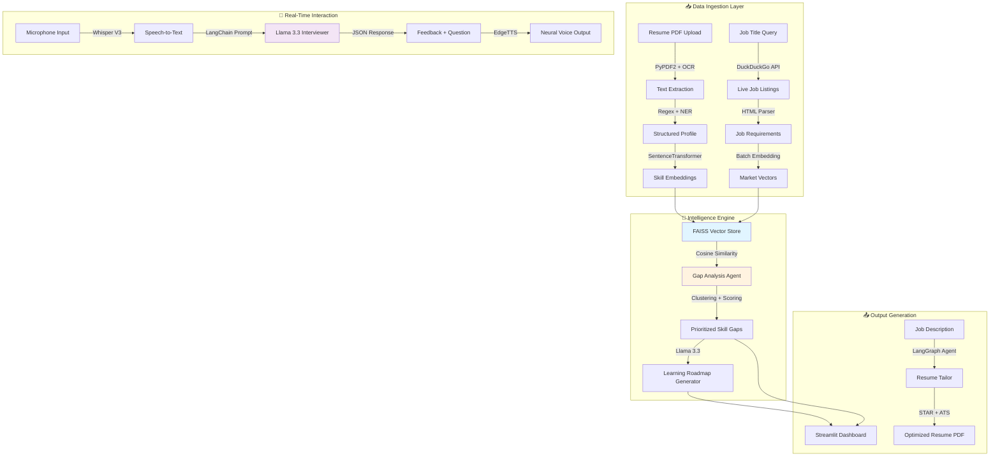
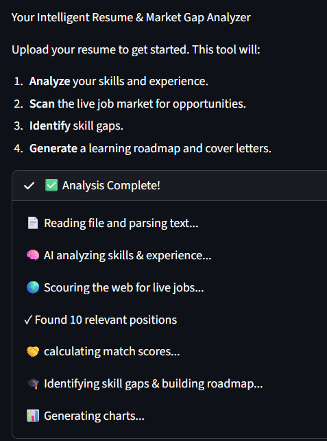
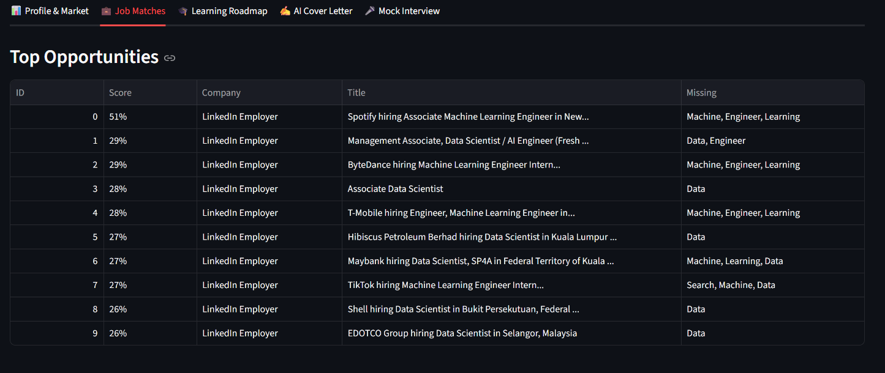
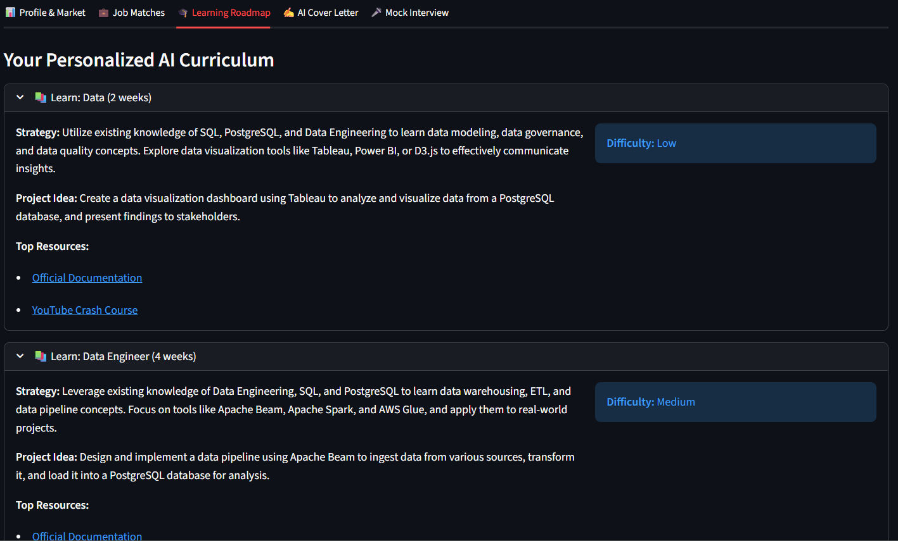
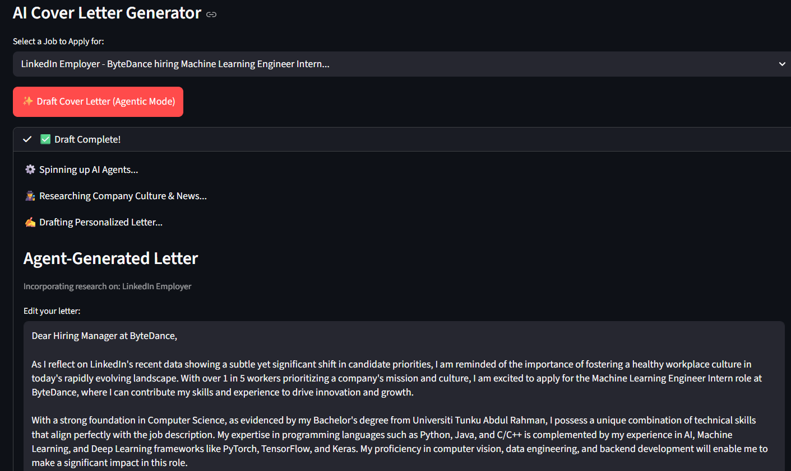

# 🧭 CareerCompass AI

### Intelligent Resume & Market Gap Analyzer with Real-Time AI Interviewer

<div align="center">


**[Features](#-features) • [Demo](#-demo) • [Quick Start](#-quick-start) • [Architecture](#-architecture) • [Documentation](#-documentation)**

</div>

---

## 🎯 What is CareerCompass AI?

CareerCompass AI is an **autonomous, multimodal AI career intelligence system** that transforms how job seekers prepare for their career journey. Instead of generic advice, it provides:

- 🔍 **Deep Resume Analysis** - Extract and validate skills using batch vector processing
- 📊 **Live Market Intelligence** - Semantic matching against real-time job market data
- 🎯 **Precision Gap Analysis** - Mathematical computation of skill gaps with severity scoring
- 🗺️ **Personalized Roadmaps** - Transfer learning strategies based on your existing stack
- 🎤 **AI Mock Interviews** - Real-time voice interaction with <1s response latency
- 📄 **ATS Optimization** - STAR-method resume tailoring for maximum ATS scores

### 💡 The Problem Solve

Traditional job applications are a **blind process** - candidates apply without knowing:
- Which specific skills they're missing
- How their background compares to market demand
- What to study to become competitive
- How to present their experience effectively

**CareerCompass AI solves this** by computing the semantic distance between your skills and real market demand, then providing an actionable plan to bridge that gap.

---

##  Features

### 🤖 AI-Powered Analysis Engine

#### **Intelligent Resume Parser**
- **Hybrid Extraction**: Combines Regex heuristics with BERT-based validation
- **Batch Vector Processing**: Matrix multiplication for instant skill categorization
- **Timeline Analysis**: Handles employment gaps and overlapping experiences
- **Contact Extraction**: Smart parsing of emails, phones, LinkedIn, GitHub profiles

#### **Semantic Market Analyzer**
- **Live Job Scraping**: DuckDuckGo-based market data acquisition with anti-bot resistance
- **Vector Matching**: FAISS-powered similarity search using sentence-transformers
- **Skill Clustering**: Groups related technologies for better gap visualization
- **Market Penetration**: Calculates exact percentage of jobs requiring each skill

#### **Smart Gap Analysis**
```
Gap Severity Score = Frequency × Domain Weight × Demand Velocity
```
- **Priority Ranking**: Differentiates between critical language gaps vs. soft skills
- **Demand Trends**: Identifies rapidly growing vs. declining technologies
- **Confidence Scoring**: Shows statistical confidence in each gap recommendation

### 🎓 Personalized Learning Engine

#### **Transfer Learning Roadmap Generator**
Unlike generic course recommendations, our AI:
- Analyzes your **existing tech stack**
- Generates **contextual learning paths** (e.g., "Since you know Java → Learn Python by focusing on...")
- Provides **hybrid resources**: AI-generated projects + curated links (LeetCode, Kaggle, Official Docs)
- Estimates **realistic timelines** based on skill similarity

**Example Output:**
```
You know: React, JavaScript
Missing: Vue.js

Transfer Strategy:
✓ Leverage your React knowledge of component lifecycle
✓ Focus on Vue's reactivity system differences
✓ Build these 3 progressive projects...
⏱️ Estimated time: 2-3 weeks
```

### 🎤 Real-Time AI Mock Interviewer

#### **Multimodal Conversation Pipeline**
```
Voice Input → Whisper V3 → Llama 3.3 → EdgeTTS → Audio Output
```

**Key Features:**
- **<1s Latency**: Powered by Groq LPU (300+ tokens/sec)
- **Structured Feedback**: JSON-formatted evaluation (Clarity, Technical Depth, Areas to Improve)
- **Progressive Difficulty**: Adapts questions based on your responses
- **Sample Answers**: Hidden expert responses for self-evaluation
- **Session Memory**: Maintains context across the entire interview

**Tech Stack:**
| Component | Technology | Why? |
|-----------|-----------|------|
| Speech-to-Text | Whisper Large V3 Turbo | 8x faster than base Whisper |
| Logic Engine | Llama 3.3 70B (JSON mode) | Structured outputs for UI integration |
| Text-to-Speech | Edge-TTS | Neural voices with zero cost/latency |

### 📄 ATS Resume Optimizer

#### **Intelligent Resume Tailoring**
- **STAR Method Injection**: Rewrites bullets as Situation → Task → Action → Result
- **Keyword Optimization**: Re-ranks skills to match job description requirements
- **ATS Compliance**: Ensures proper formatting, section headers, and parsing
- **One-Click Export**: Generates professional PDF with clean typography

**Before/After Example:**
```diff
- Worked on backend API development
+ Designed and implemented RESTful API serving 50K+ daily requests,
  reducing average response time by 40% through Redis caching and
  database query optimization (Python, Flask, PostgreSQL)
```

---

## 🏗️ Architecture

### System Design Overview



### Core Components

#### **1. Resume Parser** (`core/resume_parser.py`)
- **Input**: PDF file
- **Processing**: 
  - Text extraction (PyPDF2 with fallback to OCR)
  - Regex patterns for contact info, dates, degrees
  - BERT-based skill validation against 1000+ tech terms
- **Output**: Structured JSON profile

#### **2. Semantic Matcher** (`core/semantic_matcher.py`)
- **Model**: sentence-transformers/all-MiniLM-L6-v2 (384 dimensions)
- **Algorithm**: Batch cosine similarity with threshold=0.7
- **Performance**: Processes 500+ skills in <2 seconds
- **Output**: Matched/Missing skill categories

#### **3. Gap Analyzer** (`core/gap_analyzer.py`)
- **Scraping Strategy**: DuckDuckGo with rotating user-agents
- **Severity Algorithm**:
  ```python
  severity = (frequency / total_jobs) * domain_weight * demand_velocity
  domain_weight = {"Languages": 3.0, "Frameworks": 2.5, "Tools": 2.0}
  ```
- **Visualization**: Plotly interactive charts with drill-down

#### **4. Learning Roadmap** (`core/learning_roadmap.py`)
- **LangGraph Workflow**: Research Node → Analysis Node → Content Generation Node
- **Prompt Engineering**: Few-shot examples with transfer learning focus
- **Resource Curation**: Regex filtering for official docs + validated tutorial links

#### **5. Voice Interviewer** (`core/interviewer.py`)
- **Streaming Pipeline**: asyncio-based for parallel processing
- **State Management**: Session-scoped question history
- **Error Handling**: Automatic retry with exponential backoff

---

## 🚀 Quick Start

### Prerequisites

- **Python 3.10+**
- **Groq API Key** ([Get free key](https://console.groq.com))
- **Microphone access** (for interview feature)

### Installation

```bash
# 1️⃣ Clone the repository
git clone https://github.com/yixin16/CareerCompass-AI-Intelligent-Resume---Market-Gap-Analyzer.git
cd CareerCompass-AI-Intelligent-Resume---Market-Gap-Analyzer

# 2️⃣ Create virtual environment
python -m venv venv

# Windows
venv\Scripts\activate

# Mac/Linux
source venv/bin/activate

# 3️⃣ Install dependencies
pip install -r requirements.txt

# 4️⃣ Configure API key
# Option A: Create .env file
echo "GROQ_API_KEY=your_api_key_here" > .env

# Option B: Set environment variable
export GROQ_API_KEY="your_api_key_here"  # Mac/Linux
set GROQ_API_KEY=your_api_key_here       # Windows

# 5️⃣ Run the application
streamlit run app.py
```

The app will open at `http://localhost:8501`

---

## 📖 Usage Guide

### 1️⃣ Resume Analysis

1. **Upload Resume**: Click "Upload Resume" and select your PDF
2. **Review Extraction**: Verify contact info, skills, and experience
3. **Validation**: System uses BERT to validate technical skills against database

**What Happens Behind the Scenes:**
- Text extraction with OCR fallback
- Regex pattern matching for structured data
- Batch embedding of all skills (384-dim vectors)
- Skill categorization using semantic clustering

### 2️⃣ Market Intelligence Scan

1. **Enter Target Role**: Type job title (e.g., "Machine Learning Engineer")
2. **Optional Filters**: Add location, experience level
3. **Live Scraping**: System fetches 20-50 recent job postings
4. **Semantic Matching**: FAISS compares your skills against market demand

**Sample Output:**
```
📊 Market Analysis Results:
✅ Strong Match: Python, Docker, Git (95% of jobs)
⚠️ Partial Match: TensorFlow, Kubernetes (60% of jobs)
❌ Critical Gaps: MLflow, Airflow (80% of jobs, you're missing)
```

### 3️⃣ Gap Analysis & Roadmap

1. **View Gap Report**: Interactive Plotly chart with severity scores
2. **Generate Roadmap**: Click "Create Learning Path"
3. **Transfer Learning**: AI analyzes your stack and suggests optimized paths

**Example Roadmap Section:**
```markdown
### Missing: Apache Airflow
🔗 Transfer Path: "You know Python and Docker"
📚 Focus Areas:
  1. DAG construction (similar to Luigi pipelines)
  2. Operator patterns (like Celery tasks)
  3. Containerized deployment
📁 Projects:
  - Build ETL pipeline for e-commerce data
  - Implement ML model retraining workflow
⏱️ Timeline: 3-4 weeks
```

### 4️⃣ AI Mock Interview

1. **Start Session**: Click "Begin Interview" in sidebar
2. **Speak Naturally**: Click mic → Answer question → Release
3. **Instant Feedback**: Receive structured evaluation + next question
4. **Compare Answers**: Toggle "Show Sample Answer" to see expert response

**Interview Flow:**
```
User speaks → Whisper transcribes → Llama evaluates → EdgeTTS responds
             ↓
Question bank adapts based on:
- Your resume skills
- Target job requirements
- Previous answer quality
```

### 5️⃣ Resume Optimization

1. **Paste Job Description**: Copy target JD into text box
2. **Generate Tailored Resume**: AI rewrites experience with:
   - STAR method formatting
   - Keyword optimization for ATS
   - Quantified achievements
3. **Download PDF**: One-click export in ATS-friendly format

---

## 🛠️ Tech Stack Deep Dive

| Category | Technology | Purpose | Performance |
|----------|-----------|---------|-------------|
| **LLM** | Groq (Llama 3.3 70B) | Agentic reasoning, roadmap generation | 300+ tok/s, <1s latency |
| **Embeddings** | sentence-transformers/all-MiniLM-L6-v2 | Semantic skill matching | 384-dim, 20ms/batch |
| **Speech-to-Text** | Whisper Large V3 Turbo | Voice interview transcription | 8x faster than base |
| **Text-to-Speech** | Edge-TTS | Natural voice synthesis | Neural quality, zero cost |
| **Orchestration** | LangGraph | Agentic workflow management | State persistence, retries |
| **Vector DB** | FAISS | High-speed similarity search | 10M+ vectors, <100ms query |
| **Web Scraping** | DuckDuckGo + BeautifulSoup | Job market data | Rotating headers, resilient |
| **Frontend** | Streamlit | Rapid prototyping UI | Session state, caching |
| **PDF Processing** | PyPDF2 + xhtml2pdf | Resume parsing & generation | OCR fallback |

### Why These Choices?

**Groq over OpenAI/Anthropic:**
- 10x faster inference (critical for real-time voice)
- Free tier includes Llama 3.3 70B
- JSON mode for structured outputs

**Sentence-Transformers over OpenAI Embeddings:**
- Local inference (no API costs)
- 384 dimensions sufficient for skill matching
- 20ms batch processing vs. 200ms+ API calls

**Edge-TTS over ElevenLabs:**
- Zero cost (uses Microsoft Edge's engine)
- Acceptable quality for technical interviews
- No rate limits or quota concerns

---

## 📂 Project Structure

```
CareerCompass-AI/
│
├── 📄 app.py                          # Main Streamlit application
├── 📄 main.py                         # CLI entry point
├── 📄 config.py                       # Configuration management
├── 📄 requirements.txt                # Python dependencies
├── 📄 .env.example                    # Environment template
│
├── 📁 core/                           # Core business logic
│   ├── agent_graph.py                 # LangGraph orchestration
│   ├── interviewer.py                 # Voice pipeline (Whisper + EdgeTTS)
│   ├── resume_parser.py               # PDF extraction + NER
│   ├── semantic_matcher.py            # FAISS vector matching
│   ├── gap_analyzer.py                # Market scraping + severity scoring
│   ├── learning_roadmap.py            # Transfer learning curriculum
│   ├── resume_tailor.py               # ATS optimization agent
│   ├── cover_letter_generator.py      # Tone-adaptive writer
│   ├── job_matcher.py                 # Cosine similarity ranker
│   └── job_scraper.py                 # DuckDuckGo scraper
│
├── 📁 data/                           # Static data & templates
│   ├── skills_categories.py           # 1000+ validated tech terms
│   └── job_templates.py               # Prompt templates
│
├── 📁 utils/                          # Helper functions
│   ├── helpers.py                     # General utilities
│   ├── logger.py                      # Structured logging
│   ├── visualizer.py                  # Plotly chart generators
│   ├── report_generator.py            # Markdown report builder
│   └── pdf_generator.py               # HTML→PDF converter
│
├── 📁 sample_data/                    # Example files
│   └── resumes/
│       └── Resume.pdf                 # Sample resume for testing
│
└── 📁 assets/                         # Documentation images
    └── dashboard.png
```


---

## 🎨 Demo

### Dashboard Overview


### Feature Highlights

**Resume Analysis**



**Job Searching**
```
🔎 Dorking LinkedIn via DuckDuckGo...
✓ AI identified 40 skills across 5 categories.
🔎 Dorking LinkedIn via DuckDuckGo...
🔎 Dorking LinkedIn via DuckDuckGo...
-> Found 24 potential jobs on LinkedIn
🔎 Dorking JobStreet via DuckDuckGo...
-> Found 12 potential jobs on JobStreet
🔎 Dorking Indeed via DuckDuckGo...
-> Found 24 potential jobs on Indeed
🔎 Dorking Glassdoor via DuckDuckGo...
-> Found 24 potential jobs on Glassdoor
✓ Found 78 jobs from real-world sources.
```



**Gap Analysis Chart**

```
📊 AI analyzing skill gaps across market data...
✓ Identified 4 critical gaps.
🧠 AI Architecting Roadmap for 4 skills...
📊 Generating Skill Radar Chart...
☁️ Generating Market Keyword Cloud...
```

**Personalized Learning Roadmap**



**AI Cover Letter Generator**



**Mock Interview Session**

```

```

---

## 🔧 Configuration

### Environment Variables

Create a `.env` file in the project root:

```bash
# Required
GROQ_API_KEY=gsk_...

```

### Advanced Settings (`config.py`)

```python
# Model Configuration
LLM_MODEL = "llama-3.3-70b-versatile"
LLM_TEMPERATURE = 0.7
LLM_MAX_TOKENS = 2048

# Embedding Settings
EMBEDDING_DIMENSION = 384
BATCH_SIZE = 32

# Scraping Parameters
USER_AGENTS = [...]  # Rotating headers for anti-bot
REQUEST_TIMEOUT = 10
RETRY_ATTEMPTS = 3

# Interview Settings
STT_MODEL = "whisper-large-v3-turbo"
TTS_VOICE = "en-US-AriaNeural"
MAX_INTERVIEW_ROUNDS = 10
```

---

## 🧪 Testing

### Run Sample Analysis

```bash
# Test resume parser
python -m core.resume_parser sample_data/resumes/Resume.pdf

# Test semantic matcher
python -m core.semantic_matcher --skills "Python,Java,React"

# Test gap analyzer
python -m core.gap_analyzer --role "Data Scientist"

# Full integration test
python main.py --test-mode
```

---


## 🔮 Roadmap

### Phase 1: Core Enhancements =
- [ ] **Video Analysis**: Integrate OpenCV for facial expression/confidence scoring
- [ ] **Database Layer**: PostgreSQL for persistent user profiles & progress tracking
- [ ] **Authentication**: User accounts with OAuth2 (Google/GitHub login)
- [ ] **Mobile App**: React Native version for on-the-go practice

### Phase 2: Advanced Features
- [ ] **Salary Predictor**: ML model for compensation estimation based on skills
- [ ] **Network Analysis**: LinkedIn API integration for connection insights
- [ ] **Collaborative Mode**: Share roadmaps and interview recordings
- [ ] **Company Intel**: Glassdoor/Blind integration for culture insights


---


## 🙏 Acknowledgments

- **Groq** for blazing-fast LLM inference
- **Hugging Face** for sentence-transformers and model hosting
- **Meta** for open-sourcing Llama 3.3
- **OpenAI** for Whisper speech recognition
- **Streamlit** for the amazing web framework

---

