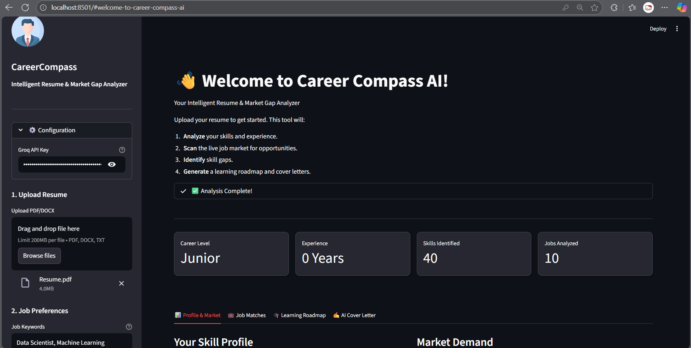

# 🧭 Career Compass AI: Intelligent Resume & Market gap Analyzer

**Intelligent Resume, Market Gap Analyzer & Agentic Career Coach**


---

## 📖 Overview

**CareerCompass AI** is an autonomous, agentic AI ecosystem designed to bridge the gap between job seekers and the live job market. Unlike standard resume parsers, this system employs **Agentic AI (LangGraph)** to actively research live job opportunities, analyze semantic fit, and provide multimodal coaching.

It solves the "blind application" problem by quantifying the alignment between a candidate's skills and market demands, offering real-time resume tailoring and voice-based interview simulation.



---

## 🚀 Key Features

### 🧠 1. Semantic Resume Analysis
*   Parses PDF/DOCX resumes to extract structured data (Skills, Experience, Education).
*   Utilizes **BERT** and **Sentence-Transformers** to create vector embeddings, allowing for deep semantic understanding of a candidate's profile.

### 🌍 2. Real-Time Market Scanner
*   Aggregates live job listings from LinkedIn, Indeed, and other sources.
*   Implements **DuckDuckGo** search dorking with rotating headers to build a resilient, anti-bot resistant scraping pipeline.

### 🕵️ 3. Agentic Cover Letter Writer (LangGraph)
*   **Autonomous Research:** An AI agent actively browses the web to find a company's latest news, values, and mission statements *before* writing.
*   **Contextual Drafting:** Generates hyper-personalized cover letters that connect the candidate's specific achievements to the company's real-world context.

### 🎨 4. AI Resume Tailor (PDF Generator)
*   **Smart Rewriting:** Rephrases resume bullet points to strictly align with specific Job Description keywords using Llama 3.
*   **Auto-Formatting:** Instantly renders the tailored content into a clean, ATS-friendly **PDF** using a professional template.

### 🎤 5. Voice-Enabled Mock Interviewer
*   **Speech-to-Text:** Transcribes candidate answers in real-time using **Distil-Whisper**.
*   **AI Evaluation:** Llama 3 acts as a senior technical interviewer, analyzing the answer and generating follow-up questions.
*   **Text-to-Speech:** Speaks back to the candidate using high-quality **Edge-TTS** for an immersive practice experience.

---

## 🛠️ Tech Stack

| Component | Technology | Description |
| :--- | :--- | :--- |
| **Frontend** | Streamlit | Interactive web dashboard & Audio Input |
| **Agentic Orchestration** | LangGraph & LangChain| Stateful multi-agentic workflows (Research -> Write) |
| **LLM Inference** | Groq Cloud (Llama-3.3-70b-Versatile) | Ultra-low latency API for **Llama 3.3** |
| **Voice AI** | Whisper Large V3 Turbo (STT) & Edge-TTS | Speech-to-Text and Text-to-Speech pipelines |
| **NLP & Embeddings** | Sentence-Transformers (all-MiniLM-L6-v2), BERT, FAISS (Vector Store) | Semantic similarity vectors |
| **PDF Engine** | xhtml2pdf | HTML-to-PDF rendering for resume tailoring |
| **Data Acquisition** | DuckDuckGo Search | Live market data aggregation |
---

## 📂 Project Structure

```
CareerCompass-AI/
├── app.py                   # Main Streamlit application
├── core/
│   ├── agent_graph.py  # LangGraph Agent (Research + Writing)
│   ├── interviewer.py  # Voice Interview Logic (Whisper + TTS)
│   ├── resume_tailor.py  # Resume Rewriting logicc
│   ├── cover_letter_generator.py
│   ├── gap_analyzer.py
│   ├── job_matcher.py
│   ├── job_scraper.py
│   ├── learning_roadmap.py
│   ├── resume_analyzer.py
│   ├── resume_parser.py
│   └── semantic_matcher.py
├── data/
│   ├── job_templates.py
│   └── skills_categories.py
├── sample_data/
│   └── resumes/Resume.pdf
├── utils/
│   ├── helpers.py
│   ├── logger.py
│   ├── report_generator.py
│   └── visualizer.py
│   └── pdf_generator.py   # HTML to PDF Conversion
├── main.py
├── config.py
├── requirements.txt
└── README.md
```

---

## ⚡ Installation & Setup

### 1. Clone the Repository

```bash
git clone https://github.com/yourusername/CareerCompass-AI.git
cd CareerCompass-AI
```

### 2. Create Virtual Environment

```bash
# Windows
python -m venv venv
venv\Scripts\activate

# Mac/Linux
python3 -m venv venv
source venv/bin/activate
```

### 3. Install Dependencies

```bash
pip install -r requirements.txt
```

### 4. Set Up API Keys

* Groq API Key is required for LLM features.
* Get a free key at [console.groq.com](https://console.groq.com) and configure it in the sidebar / or place in the .env file.

### 5. Run the Application

```bash
streamlit run app.py
```

---

## 📸 Usage Guide

1. **Upload Profile:** Drag & drop your PDF resume in the sidebar.
2. **Set Preferences:** Enter target role and location.
3. **Run Analysis:** Click **Run Analysis** to parse data and scrape live job listings.
4. **View Insights:**

   * **Market Tab:** Compare your skills with market trends via radar charts.
   * **Matches Tab:** View ranked job opportunities with match scores.
   * **Roadmap Tab:** Generate a step-by-step learning plan for missing skills.
   * **Cover Letter Tab:** Select a job and let AI draft a personalized cover letter.
5. **Mock Interview** Go to the "Mock Interview" tab, click "Start Session," and use your microphone to practice technical questions.

---

## 🔮 Future Roadmap

* **Dockerization:** Containerize the application for easy deployment on cloud platforms (AWS/Azure).
* **Database Integration:** Add PostgreSQL/SQLite to save user profiles and chat history persistently.
* **Video Analysis:** Analyze user's facial expressions during mock interviews using OpenCV.

---


*This project was developed as a comprehensive portfolio showcase demonstrating expertise in Full-Stack GenAI, Agentic Workflows, NLP, and System Architecture.*
