# 🧭 CareerCompass AI

### Intelligent Resume & Market Gap Analyzer with Real-Time AI Interviewer

<div align="center">


**[Features](#-features) • [Demo](#-demo) • [Quick Start](#-quick-start) • [Architecture](#-architecture) • [Documentation](#-documentation)**

</div>

---

## 🎯 What is CareerCompass AI?

CareerCompass AI is an **autonomous, multimodal AI career intelligence system** that transforms how job seekers prepare for their career journey. Instead of generic advice, it provides:

- 🔍 **Deep Resume Analysis** - Extract and validate skills using batch vector processing
- 📊 **Live Market Intelligence** - Semantic matching against real-time job market data
- 🎯 **Precision Gap Analysis** - Mathematical computation of skill gaps with severity scoring
- 🗺️ **Personalized Roadmaps** - Transfer learning strategies based on your existing stack
- 🎤 **AI Mock Interviews** - Real-time voice interaction with customizable difficulty levels
- 📄 **ATS Optimization** - STAR-method resume tailoring for maximum ATS scores

### 💡 The Problem We Solve

Traditional job applications are a **blind process** - candidates apply without knowing:
- Which specific skills they're missing
- How their background compares to market demand
- What to study to become competitive
- How to present their experience effectively

**CareerCompass AI solves this** by computing the semantic distance between your skills and real market demand, then providing an actionable plan to bridge that gap.

---

## ✨ Features

### 🤖 AI-Powered Analysis Engine

#### **Intelligent Resume Parser**
- **Hybrid Extraction**: Combines Regex heuristics with BERT-based validation
- **Batch Vector Processing**: Matrix multiplication for instant skill categorization
- **Timeline Analysis**: Handles employment gaps and overlapping experiences
- **Contact Extraction**: Smart parsing of emails, phones, LinkedIn, GitHub profiles

#### **Semantic Market Analyzer**
- **Live Job Scraping**: DuckDuckGo-based market data acquisition with anti-bot resistance
- **Vector Matching**: FAISS-powered similarity search using sentence-transformers
- **Skill Clustering**: Groups related technologies for better gap visualization
- **Market Penetration**: Calculates exact percentage of jobs requiring each skill

#### **Smart Gap Analysis**
```
Gap Severity Score = Frequency × Domain Weight × Demand Velocity
```
- **Priority Ranking**: Differentiates between critical language gaps vs. soft skills
- **Demand Trends**: Identifies rapidly growing vs. declining technologies
- **Confidence Scoring**: Shows statistical confidence in each gap recommendation

### 🎓 Personalized Learning Engine

#### **Transfer Learning Roadmap Generator**
Unlike generic course recommendations, our AI:
- Analyzes your **existing tech stack**
- Generates **contextual learning paths** (e.g., "Since you know Java → Learn Python by focusing on...")
- Provides **hybrid resources**: AI-generated projects + curated links (LeetCode, Kaggle, Official Docs)
- Estimates **realistic timelines** based on skill similarity

**Example Output:**
```
You know: React, JavaScript
Missing: Vue.js

Transfer Strategy:
✓ Leverage your React knowledge of component lifecycle
✓ Focus on Vue's reactivity system differences
✓ Build these 3 progressive projects...
⏱️ Estimated time: 2-3 weeks
```

### 🎤 Real-Time AI Mock Interviewer

#### **Multimodal Conversation Pipeline**
```
Voice Input → Whisper V3 → Llama 3.3 → EdgeTTS → Audio Output
```

**Advanced Features:**
- **<1s Latency**: Powered by Groq LPU (300+ tokens/sec)
- **4 Difficulty Levels**: Entry (0-2 yrs) → Mid (2-5 yrs) → Senior (5-10 yrs) → Staff (10+ yrs)
- **3 Interview Focuses**: Behavioral (80/20) / Technical (90/10) / Balanced (50/50)
- **AI Engineer Specialization**: Deep knowledge of ML/AI, NLP, Computer Vision, MLOps
- **Job-Specific Context**: Tailored questions based on selected job position
- **Progressive Difficulty**: Questions adapt based on your performance
- **Expert Sample Answers**: Level-appropriate responses with STAR method

#### **Configuration Matrix**

| Difficulty | Experience | Question Style |
|-----------|-----------|----------------|
| 🌱 **Entry** | 0-2 years | Fundamentals, willingness to learn |
| 🚀 **Mid** | 2-5 years | Practical implementation, debugging |
| ⭐ **Senior** | 5-10 years | Architecture, scalability, trade-offs |
| 👑 **Staff** | 10+ years | Multi-system architecture, org impact |

| Focus | Split | Best For |
|-------|-------|----------|
| 💬 **Behavioral** | 80% Behavioral / 20% Technical | Management roles, culture-fit |
| 💻 **Technical** | 90% Technical / 10% Behavioral | IC roles, technical specialists |
| ⚖️ **Balanced** | 50% / 50% | General roles, holistic assessment |

**Tech Stack:**
| Component | Technology | Why? |
|-----------|-----------|------|
| Speech-to-Text | Whisper Large V3 Turbo | 8x faster than base Whisper |
| Logic Engine | Llama 3.3 70B (JSON mode) | Structured outputs, <1s latency |
| Text-to-Speech | Edge-TTS + gTTS | Neural voices with fallback reliability |

### 📄 ATS Resume Optimizer

#### **Intelligent Resume Tailoring**
- **STAR Method Injection**: Rewrites bullets as Situation → Task → Action → Result
- **Keyword Optimization**: Re-ranks skills to match job description requirements
- **ATS Compliance**: Ensures proper formatting, section headers, and parsing
- **One-Click Export**: Generates professional PDF with clean typography

**Before/After Example:**
```diff
- Worked on backend API development
+ Designed and implemented RESTful API serving 50K+ daily requests,
  reducing average response time by 40% through Redis caching and
  database query optimization (Python, Flask, PostgreSQL)
```

---

## 🏗️ Architecture

### System Design Overview

```mermaid
graph TB
    subgraph "📥 Data Ingestion Layer"
        A[Resume PDF Upload] -->|PyPDF2 + OCR| B[Text Extraction]
        B -->|Regex + NER| C[Structured Profile]
        C -->|SentenceTransformer| D[Skill Embeddings]
        
        E[Job Title Query] -->|DuckDuckGo API| F[Live Job Listings]
        F -->|HTML Parser| G[Job Requirements]
        G -->|Batch Embedding| H[Market Vectors]
    end
    
    subgraph "🧠 Intelligence Engine"
        D --> I[FAISS Vector Store]
        H --> I
        I -->|Cosine Similarity| J[Gap Analysis Agent]
        J -->|Clustering + Scoring| K[Prioritized Skill Gaps]
        K -->|Llama 3.3| L[Learning Roadmap Generator]
    end
    
    subgraph "🎤 Real-Time Interaction"
        M[Microphone Input] -->|Whisper V3| N[Speech-to-Text]
        N -->|Context-Aware Prompt| O[Llama 3.3 Interviewer]
        O -->|JSON Response| P[Question + Sample Answer]
        P -->|EdgeTTS/gTTS| Q[Neural Voice Output]
    end
    
    subgraph "📤 Output Generation"
        L --> R[Streamlit Dashboard]
        K --> R
        S[Job Description] -->|LangGraph Agent| T[Resume Tailor]
        T -->|STAR + ATS| U[Optimized Resume PDF]
    end
    
    style I fill:#e1f5ff
    style J fill:#fff3e0
    style O fill:#f3e5f5
```



### Core Components

#### **1. Resume Parser** (`core/resume_parser.py`)
- **Input**: PDF file
- **Processing**: 
  - Text extraction (PyPDF2 with fallback to OCR)
  - Regex patterns for contact info, dates, degrees
  - BERT-based skill validation against 1000+ tech terms
- **Output**: Structured JSON profile

#### **2. Semantic Matcher** (`core/semantic_matcher.py`)
- **Model**: sentence-transformers/all-MiniLM-L6-v2 (384 dimensions)
- **Algorithm**: Batch cosine similarity with threshold=0.7
- **Performance**: Processes 500+ skills in <2 seconds
- **Output**: Matched/Missing skill categories

#### **3. Gap Analyzer** (`core/gap_analyzer.py`)
- **Scraping Strategy**: DuckDuckGo with rotating user-agents
- **Severity Algorithm**:
  ```python
  severity = (frequency / total_jobs) * domain_weight * demand_velocity
  domain_weight = {"Languages": 3.0, "Frameworks": 2.5, "Tools": 2.0}
  ```
- **Visualization**: Plotly interactive charts with drill-down

#### **4. Learning Roadmap** (`core/learning_roadmap.py`)
- **LangGraph Workflow**: Research Node → Analysis Node → Content Generation Node
- **Prompt Engineering**: Few-shot examples with transfer learning focus
- **Resource Curation**: Regex filtering for official docs + validated tutorial links

#### **5. Context-Aware Mock Interviewer** (`core/interviewer.py`)
- **Multi-Level System**: Entry/Mid/Senior/Staff difficulty calibration
- **Focus Control**: Behavioral/Technical/Balanced question distribution
- **AI Engineer Specialization**: ML fundamentals, LLMs, NLP, Computer Vision, MLOps knowledge base
- **Adaptive Logic**: Progressive difficulty based on answer quality
- **Dual TTS Engine**: EdgeTTS with gTTS fallback for reliability

---

## 🚀 Quick Start

### Prerequisites

- **Python 3.10+**
- **Groq API Key** ([Get free key](https://console.groq.com))
- **Microphone access** (for interview feature)

### Installation

```bash
# 1️⃣ Clone the repository
git clone https://github.com/yixin16/CareerCompass-AI-Intelligent-Resume---Market-Gap-Analyzer.git
cd CareerCompass-AI-Intelligent-Resume---Market-Gap-Analyzer

# 2️⃣ Create virtual environment
python -m venv venv

# Windows
venv\Scripts\activate

# Mac/Linux
source venv/bin/activate

# 3️⃣ Install dependencies
pip install -r requirements.txt

# 4️⃣ Configure API key
# Option A: Create .env file
echo "GROQ_API_KEY=your_api_key_here" > .env

# Option B: Set environment variable
export GROQ_API_KEY="your_api_key_here"  # Mac/Linux
set GROQ_API_KEY=your_api_key_here       # Windows

# 5️⃣ Run the application
streamlit run app.py
```

The app will open at `http://localhost:8501`

---

## 📖 Usage Guide

### 1️⃣ Resume Analysis

1. **Upload Resume**: Click "Upload Resume" and select your PDF
2. **Review Extraction**: Verify contact info, skills, and experience
3. **Validation**: System uses BERT to validate technical skills against database

**What Happens Behind the Scenes:**
- Text extraction with OCR fallback
- Regex pattern matching for structured data
- Batch embedding of all skills (384-dim vectors)
- Skill categorization using semantic clustering

### 2️⃣ Market Intelligence Scan

1. **Enter Target Role**: Type job title (e.g., "Machine Learning Engineer")
2. **Optional Filters**: Add location, experience level
3. **Live Scraping**: System fetches 20-50 recent job postings from multiple sources
4. **Semantic Matching**: FAISS compares your skills against market demand

**Sample Output:**
```
🔎 Dorking LinkedIn via DuckDuckGo...
-> Found 24 potential jobs on LinkedIn
🔎 Dorking JobStreet via DuckDuckGo...
-> Found 12 potential jobs on JobStreet
✓ Found 78 jobs from real-world sources.

📊 Market Analysis Results:
✅ Strong Match: Python, Docker, Git (95% of jobs)
⚠️ Partial Match: TensorFlow, Kubernetes (60% of jobs)
❌ Critical Gaps: MLflow, Airflow (80% of jobs, you're missing)
```

### 3️⃣ Gap Analysis & Roadmap

1. **View Gap Report**: Interactive Plotly chart with severity scores
2. **Generate Roadmap**: Click "Create Learning Path"
3. **Transfer Learning**: AI analyzes your stack and suggests optimized paths

**Example Roadmap Section:**
```markdown
### Missing: Apache Airflow
🔗 Transfer Path: "You know Python and Docker"
📚 Focus Areas:
  1. DAG construction (similar to Luigi pipelines)
  2. Operator patterns (like Celery tasks)
  3. Containerized deployment
📁 Projects:
  - Build ETL pipeline for e-commerce data
  - Implement ML model retraining workflow
⏱️ Timeline: 3-4 weeks
```

### 4️⃣ AI Mock Interview

#### **Step 1: Configure Your Interview**
1. **Select Target Job**: Choose from your matched positions or generic AI Engineer
2. **Choose Focus**: 
   - 💬 **Behavioral** (80/20) - Leadership, teamwork, communication
   - 💻 **Technical** (90/10) - Deep technical, algorithms, system design
   - ⚖️ **Balanced** (50/50) - Holistic evaluation
3. **Set Difficulty**:
   - 🌱 **Entry** - Fundamentals and basic concepts
   - 🚀 **Mid** - Practical implementation and debugging
   - ⭐ **Senior** - Architecture and scalability
   - 👑 **Staff** - Org-wide impact and strategic vision

#### **Step 2: Practice Interview**
1. **Start Session**: Click "Start Interview Session"
2. **Listen**: AI asks job-specific questions
3. **Speak**: Record your answer using the microphone
4. **Get Feedback**: Receive immediate evaluation
5. **View Sample**: Check expert-level answers for guidance

**Interview Flow:**
```
User speaks → Whisper transcribes → Llama evaluates → EdgeTTS responds
             ↓
Question adapts based on:
- Your resume skills
- Target job requirements
- Selected difficulty level
- Interview focus (behavioral/technical)
- Previous answer quality
```

**Example Questions by Level:**

**Entry-Level Technical:**
```
"Can you explain what overfitting is and how you would detect it?"
```

**Senior-Level Behavioral:**
```
"Tell me about a time you had to make a critical technical decision 
that affected multiple teams. Use the STAR method."
```

**Staff-Level Balanced:**
```
"How would you design a distributed training system for a 70B parameter 
foundation model? Consider architecture, cost, and fault tolerance."
```

### 5️⃣ Resume Optimization

1. **Select Target Job**: Choose from your matched positions
2. **Generate Tailored Resume**: AI rewrites experience with:
   - STAR method formatting
   - Keyword optimization for ATS
   - Quantified achievements
3. **Download PDF**: One-click export in ATS-friendly format

---

## 🛠️ Tech Stack Deep Dive

| Category | Technology | Purpose | Performance |
|----------|-----------|---------|-------------|
| **LLM** | Groq (Llama 3.3 70B) | Agentic reasoning, roadmap generation | 300+ tok/s, <1s latency |
| **Embeddings** | sentence-transformers/all-MiniLM-L6-v2 | Semantic skill matching | 384-dim, 20ms/batch |
| **Speech-to-Text** | Whisper Large V3 Turbo | Voice interview transcription | 8x faster than base |
| **Text-to-Speech** | Edge-TTS + gTTS | Natural voice synthesis | Neural quality with reliability |
| **Orchestration** | LangGraph | Agentic workflow management | State persistence, retries |
| **Vector DB** | FAISS | High-speed similarity search | 10M+ vectors, <100ms query |
| **Web Scraping** | DuckDuckGo + BeautifulSoup | Job market data | Rotating headers, resilient |
| **Frontend** | Streamlit | Rapid prototyping UI | Session state, caching |
| **PDF Processing** | PyPDF2 + xhtml2pdf | Resume parsing & generation | OCR fallback |

### Why These Choices?

**Groq over OpenAI/Anthropic:**
- 10x faster inference (critical for real-time voice)
- Free tier includes Llama 3.3 70B
- JSON mode for structured outputs

**Sentence-Transformers over OpenAI Embeddings:**
- Local inference (no API costs)
- 384 dimensions sufficient for skill matching
- 20ms batch processing vs. 200ms+ API calls

**Edge-TTS + gTTS Dual System:**
- EdgeTTS for neural voice quality
- gTTS as reliable fallback
- Zero cost with no rate limits

---

## 📂 Project Structure

```
CareerCompass-AI/
│
├── 📄 app.py                          # Main Streamlit application
├── 📄 main.py                         # CLI entry point
├── 📄 config.py                       # Configuration management
├── 📄 requirements.txt                # Python dependencies
├── 📄 .env.example                    # Environment template
│
├── 📁 core/                           # Core business logic
│   ├── agent_graph.py                 # LangGraph orchestration
│   ├── interviewer.py                 # Context-aware voice pipeline
│   ├── resume_parser.py               # PDF extraction + NER
│   ├── semantic_matcher.py            # FAISS vector matching
│   ├── gap_analyzer.py                # Market scraping + severity scoring
│   ├── learning_roadmap.py            # Transfer learning curriculum
│   ├── resume_tailor.py               # ATS optimization agent
│   ├── cover_letter_generator.py      # Tone-adaptive writer
│   ├── job_matcher.py                 # Cosine similarity ranker
│   └── job_scraper.py                 # Multi-source job scraper
│
├── 📁 data/                           # Static data & templates
│   ├── skills_categories.py           # 1000+ validated tech terms
│   └── job_templates.py               # Prompt templates
│
├── 📁 utils/                          # Helper functions
│   ├── helpers.py                     # General utilities
│   ├── logger.py                      # Structured logging
│   ├── visualizer.py                  # Plotly chart generators
│   ├── report_generator.py            # Markdown report builder
│   └── pdf_generator.py               # HTML→PDF converter
│
├── 📁 sample_data/                    # Example files
│   └── resumes/
│       └── Resume.pdf                 # Sample resume for testing
│
└── 📁 assets/                         # Documentation images
    ├── dashboard.png
    ├── resume_analysis.png
    ├── job_match.png
    ├── roadmap.png
    ├── letter.png
    └── interviewer.png
```

---

## 🎨 Demo

### Dashboard Overview


### Resume Analysis


**AI identifies 40 skills across 5 categories with semantic validation**

### Job Market Intelligence
```
🔎 Dorking LinkedIn via DuckDuckGo...
🔎 Dorking JobStreet via DuckDuckGo...
-> Found 24 potential jobs on LinkedIn
-> Found 12 potential jobs on JobStreet
🔎 Dorking Indeed via DuckDuckGo...
-> Found 24 potential jobs on Indeed
🔎 Dorking Glassdoor via DuckDuckGo...
-> Found 24 potential jobs on Glassdoor
✓ Found 78 jobs from real-world sources.
```


### Gap Analysis & Learning Roadmap
```
📊 AI analyzing skill gaps across market data...
✓ Identified 4 critical gaps.
🧠 AI Architecting Roadmap for 4 skills...
📊 Generating Skill Radar Chart...
☁️ Generating Market Keyword Cloud...
```


### AI Cover Letter Generator


### Context-Aware Mock Interviewer


**Features:**
- ✅ 4 difficulty levels (Entry → Staff)
- ✅ 3 interview focuses (Behavioral/Technical/Balanced)
- ✅ Job-specific questions
- ✅ Real-time feedback
- ✅ Expert sample answers

---

## 🔧 Configuration

### Environment Variables

Create a `.env` file in the project root:

```bash
# Required
GROQ_API_KEY=gsk_...
```

### Advanced Settings (`config.py`)

```python
# Model Configuration
LLM_MODEL = "llama-3.3-70b-versatile"
LLM_TEMPERATURE = 0.7
LLM_MAX_TOKENS = 2048

# Embedding Settings
EMBEDDING_DIMENSION = 384
BATCH_SIZE = 32

# Scraping Parameters
USER_AGENTS = [...]  # Rotating headers for anti-bot
REQUEST_TIMEOUT = 10
RETRY_ATTEMPTS = 3

# Interview Settings
STT_MODEL = "whisper-large-v3-turbo"
TTS_VOICE = "en-US-AriaNeural"
DIFFICULTY_LEVELS = ["entry", "medium", "senior", "staff"]
FOCUS_OPTIONS = ["behavioral", "technical", "balanced"]
```
---

## 🔮 Roadmap

### Phase 1: 
- [ ] **Video Analysis**: Integrate OpenCV for facial expression/confidence scoring
- [ ] **Database Layer**: PostgreSQL for persistent user profiles & progress tracking
- [ ] **Authentication**: User accounts with OAuth2 (Google/GitHub login)
- [ ] **Mobile App**: React Native version for on-the-go practice

### Phase 2:
- [ ] **Interview Analytics**: Performance scoring, strengths/weaknesses report
- [ ] **Salary Predictor**: ML model for compensation estimation based on skills
- [ ] **Network Analysis**: LinkedIn API integration for connection insights
- [ ] **Collaborative Mode**: Share roadmaps and interview recordings

### Phase 3:
- [ ] **B2B Platform**: White-label version for recruitment agencies
- [ ] **Bulk Processing**: Batch resume screening for hiring managers
- [ ] **API Marketplace**: Public API for third-party integrations
- [ ] **Custom Training**: Fine-tuned models for niche industries

---


## 🙏 Acknowledgments

- **Groq** for blazing-fast LLM inference
- **Hugging Face** for sentence-transformers and model hosting
- **Meta** for open-sourcing Llama 3.3
- **OpenAI** for Whisper speech recognition
- **Streamlit** for the amazing web framework
- **Microsoft** for Edge-TTS neural voices

---
